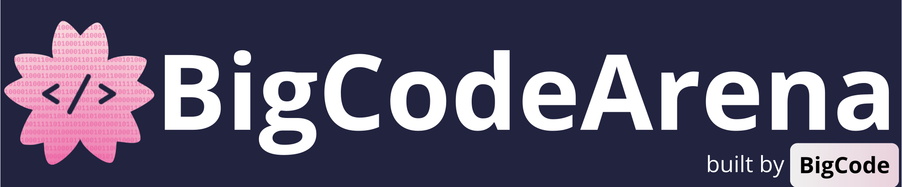

# BigCodeArena

<p align="center">
  
</p>

<p align="center">
    <a href="https://huggingface.co/spaces/bigcode/arena"></a>
    <a href="https://huggingface.co/collections/bigcode/bigcodearena-68cd3a196e5147cc45f8ea3d"></a>
    <a href="https://arxiv.org"></a>
    <a href="https://github.com/bigcode-project/bigcodearena/blob/master/LICENSE"></a>
</p>

<p align="center">
    <a href="#-about">🌸 About</a> •
    <a href="#-installation">📦 Installation</a> •
    <a href="#-bigcodereward">🏆 BigCodeReward</a> •
    <a href="#-autocodearena">🎯 AutoCodeArena</a> •
    <a href="#-huggingface-space">🌐 HF Space</a> •
    <a href="#-configuration">🔧 Configuration</a> •
    <a href="#-citation">📜 Citation</a>
</p>

## 🌸 About

**BigCodeArena** is an open human evaluation platform for code generation, built on top of Chatbot Arena with a comprehensive and on-the-fly execution environment. Unlike traditional evaluation platforms, BigCodeArena enables the execution of LLM-generated code and allows humans to interact with execution processes and outcomes, addressing the challenge of manually examining code quality.

## 📦 Installation

```bash
git clone https://github.com/bigcode-project/bigcodearena.git
cd bigcodearena

# Install dependencies for AutoCodeArena
cd autocodearena
pip install -r requirements.txt

# Install dependencies for BigCodeReward
cd ../bigcodereward
pip install -r requirements.txt
```

### Prerequisites

- Python 3.8+
- Docker (required for AutoCodeArena code execution)
- API keys for LLM providers (OpenAI, Anthropic, etc.)

### Docker Setup (for AutoCodeArena)

```bash
# Install Docker
curl -fsSL https://get.docker.com -o get-docker.sh
sudo sh get-docker.sh
sudo usermod -aG docker $USER
newgrp docker

# Build sandbox images
cd autocodearena
python build_docker_images.py
```

## 🏆 BigCodeReward

**Purpose**: Evaluate reward model consistency with human preferences on code generation tasks

BigCodeReward uses 4.7K+ postprocessed conversations from BigCodeArena to systematically evaluate how well LLM-based reward models align with actual human preferences in code generation scenarios.


**Evaluation Pipeline**:
1. **Evaluate** - Judge code comparisons using LLM-as-a-Judge (with/without execution)
2. **Analyze** - Compute performance metrics and consistency scores
3. **Correlate** - Calculate ELO ratings and correlation with human votes

**Evaluation Modes**:
- **With Execution**: Judge models see code + execution results + screenshots
- **Without Execution**: Judge models see code only (code-centric evaluation)

### Quick Start

Evaluate reward model alignment with human preferences:

**Step 1: Set API Keys**
```bash
export OPENAI_API_KEY="sk-..."
```

**Step 2: Evaluate Judge Models**
```bash
cd bigcodereward

# Evaluate with execution results (recommended)
python eval_hf_data.py --judge-model gpt-4o --workers 8

# Evaluate code-only (without execution)
python eval_hf_data.py --judge-model gpt-4o --no-output --workers 8

# Analyze consistency with human preferences
python analyze_model_judge_results.py

# Compute ELO ratings and correlations
python analyze_elo.py
```

**Key Metrics**:
- Accuracy, F1-score
- ELO ratings with confidence intervals
- Correlation with human preferences (Spearman, Pearson)

### Available Scripts

| Script | Description | Key Options |
|--------|-------------|-------------|
| `eval_hf_data.py` | Evaluate judge models on code comparisons | `--judge-model` (required), `--workers`, `--max-records`, `--no-output` |
| `analyze_model_judge_results.py` | Analyze judge performance metrics | `--results-dir`, `--output-dir` |
| `analyze_elo.py` | Compute ELO ratings and correlations | `--results-dir`, `--k-factor`, `--scale` |

**Examples:**
```bash
# Test with limited records
python eval_hf_data.py --judge-model gpt-4o --max-records 100

# Batch evaluation
for model in gpt-4o gpt-4o-mini claude-3.5-sonnet; do
    python eval_hf_data.py --judge-model $model --workers 8
done
python analyze_model_judge_results.py
python analyze_elo.py
```

## 🎯 AutoCodeArena

**Purpose**: Automatic Elo rating benchmark to assess LLM coding quality without human evaluation

AutoCodeArena is an automatic evaluation benchmark inspired by findings from BigCodeReward, designed to systematically assess code generation capabilities of frontier LLMs using execution-based evaluation.

**Evaluation Pipeline**:
1. **Generate** - Generate code solutions from LLMs for benchmark tasks
2. **Execute** - Run code in sandboxed Docker environments across multiple frameworks
3. **Judge** - Evaluate quality using LLM-as-a-judge with execution results
4. **Rate** - Compute Elo ratings and display leaderboards

**Supported Environments**:
- HTML/JavaScript, React, Vue
- Python, PyGame
- Streamlit, Gradio
- And more...

### Quick Start

Evaluate LLMs using the automatic Elo rating system:

**Step 1: Set API Keys**
```bash
# Any other API keys you need to set
export OPENAI_API_KEY="sk-..."
export ANTHROPIC_API_KEY="sk-..."
```

**Step 2: Configure Models** (edit `autocodearena/config/gen_answer_config.yaml`)
```yaml
model_list:
  - gpt-4o-2024-11-20
  - claude-3.5-sonnet
  - your-model-name
```

**Step 3: Run Automatic Evaluation**
```bash
cd autocodearena

# Generate code solutions from LLMs
python gen_answer.py

# Execute in sandboxed environments  
python gen_execution.py --data_path data/autocodearena/model_answer

# Judge with LLM using execution results
python gen_judgment.py

# Display Elo ratings and leaderboard
python show_result.py --benchmark autocodearena-v0
```

### Available Scripts

| Script | Description | Key Options |
|--------|-------------|-------------|
| `gen_answer.py` | Generate code solutions from models | `--config-file`, `--dataset`, `--regenerate-empty` |
| `gen_execution.py` | Execute code in Docker sandboxes | `--data_path`, `--model_name`, `--environment`, `--max_workers` |
| `gen_judgment.py` | Generate LLM-as-a-judge evaluations | `--setting-file`, `--no-execution-results`, `--demo` |
| `show_result.py` | Display leaderboards and results | `--benchmark`, `--by {env,topic}`, `--json`, `--latex` |
| `build_docker_images.py` | Build Docker images for sandboxes | (no options) |

**Examples:**
```bash
# Execute with custom settings
python gen_execution.py --data_path data/autocodearena \
    --model_name gpt-4o --max_workers 20 --timeout 180

# Show results by environment
python show_result.py --benchmark autocodearena-v0 --by env

# Export to JSON
python show_result.py --benchmark autocodearena-v0 --json results.json
```

## 🌐 HuggingFace Space

The `hf_space/` directory contains the code for the **live BigCodeArena platform** deployed on HuggingFace Spaces.

**Purpose**: Interactive web interface where users can chat with LLMs and provide human preferences on code generation

**Key Features**:
- Real-time chat with multiple LLMs for coding tasks
- Side-by-side code execution and comparison
- Human voting on code quality (vote_left, vote_right, vote_tie, vote_both_bad)
- ELO rating leaderboard based on human preferences
- Sandboxed code execution with visual outputs

**Main Components**:
- `app.py` - Main Gradio application interface
- `conversation.py` - Multi-turn conversation management
- `voting.py` - Human preference collection system
- `elo_calculation.py` - Real-time ELO rating computation
- `sandbox/` - Code execution environment
- `e2b_sandbox_template/` - E2B sandbox configurations

**Live Platform**: [🤗 BigCodeArena Space](https://huggingface.co/spaces/bigcode/arena)

## 🔧 Configuration

### Required Environment Variables

```bash
# At least one API key is required
export OPENAI_API_KEY="sk-..."              # OpenAI models
export ANTHROPIC_API_KEY="sk-ant-..."      # Anthropic/Claude models
export OPENROUTER_API_KEY="..."            # OpenRouter
```

### AutoCodeArena Configuration

**1. Configure Models** (`autocodearena/config/gen_answer_config.yaml`):
```yaml
bench_name: autocodearena

model_list:
  - gpt-4o-2024-11-20
  - gpt-4o-mini-2024-07-18
  - your-custom-model
```

**2. Configure API Endpoints** (`autocodearena/config/api_config.yaml`):
```yaml
your-custom-model:
  model: provider/model-name
  endpoints:
    - api_base: https://api.provider.com/v1
      api_key: ${YOUR_API_KEY}
  api_type: openai  # or openai_thinking, litellm, deepseek_reasoner
  parallel: 32
  max_tokens: 8192
  temperature: 0.0
```

**3. Configure Judge** (`autocodearena/config/autocodearena.yaml`):
```yaml
judge_model: claude37_sonnet
temperature: 0.0
bench_name: autocodearena-v0
baseline_model: gpt-4.1-2025-04-14
model_list:
  - gpt-4o-2024-11-20
  - your-model-to-evaluate
```

### BigCodeReward Configuration

**1. Configure Judge Models** (`bigcodereward/config/judge_model_config.yaml`):
```yaml
your-custom-judge:
  model_id: provider/model-name
  api_type: openai  # or litellm, sglang
  context_limit: 128000
  min_request_interval: 1.0
```

**2. Configure Evaluation** (`bigcodereward/config/bigcodereward.yaml`):
```yaml
dataset:
  name: bigcode/bigcodereward

default_judge_model: sonnet35v2

evaluation:
  default_workers: 8
  include_output: true

elo_params:
  K: 4
  SCALE: 400
  BASE: 10
  INIT_RATING: 1000
```

## 📊 Complete Workflows

### BigCodeReward: Human Preference Alignment

```bash
cd bigcodereward

# 1. Set API keys for judge models
export OPENAI_API_KEY="sk-..."

# 2. Evaluate judge model consistency (with execution)
python eval_hf_data.py --judge-model gpt-4o --workers 8

# 3. Evaluate judge model (code-only)
python eval_hf_data.py --judge-model gpt-4o --no-output --workers 8

# 4. Analyze alignment with human preferences
python analyze_model_judge_results.py

# 5. Compute ELO and correlation metrics
python analyze_elo.py

# Results demonstrate:
# - Judge model accuracy vs human preferences
# - Impact of execution results on judgment quality
# - Correlation metrics with human votes
```

### AutoCodeArena: Automatic Elo Rating Evaluation

```bash
cd autocodearena

# 1. Set API keys for LLMs to evaluate
export OPENAI_API_KEY="sk-..."
export ANTHROPIC_API_KEY="sk-..."

# 2. Configure models to evaluate (edit config/gen_answer_config.yaml)

# 3. Generate code solutions
python gen_answer.py

# 4. Execute in sandboxed environments (captures screenshots)
python gen_execution.py --data_path data/autocodearena

# 5. Judge using LLM with execution results
python gen_judgment.py

# 6. Display Elo ratings and leaderboard
python show_result.py --benchmark autocodearena-v0

# Optional: View by environment or category
python show_result.py --benchmark autocodearena-v0 --by env
python show_result.py --benchmark autocodearena-v0 --topic web_design
```

## 🤝 Contributing

Contributions are welcome! Please:

1. Fork the repository
2. Create a feature branch
3. Make your changes
4. Submit a pull request

For bugs or feature requests, please file an issue on GitHub.

## 📄 License

Apache 2.0 - See LICENSE file for details

## 📜 Citation

```bibtex
@article{zhuo2025bigcodearena,
    title={BigCodeArena: Unveiling More Reliable Human Preferences in Code Generation via Execution},
    author={Terry Yue Zhuo, Xiaolong Jin, Hange Liu, Juyong Jiang, Tianyang Liu, Chen Gong, Bhupesh Bishnoi, Vaisakhi Mishra, Marek Suppa, Noah Ziems, Saiteja Utpala, Ming Xu, Guangyu Song, Kaixin Li, Yuhan Cao, Bo Liu, Zheng Liu, Sabina Abdurakhmanova, Wenhao Yu, Mengzhao Jia, Jihan Yao, Kenneth Hamilton, Kumar Shridhar, Minh Chien Vu, Dingmin Wang, Jiawei Liu, Zijian Wang, Qian Liu, Binyuan Hui, Meg Risdal, Ahsen Khaliq, Atin Sood, Zhenchang Xing, Wasi Uddin Ahmad, John Grundy, David Lo, Banghua Zhu, Xiaoning Du, Torsten Scholak, Leandro von Werra},
    year={2025}
}
```